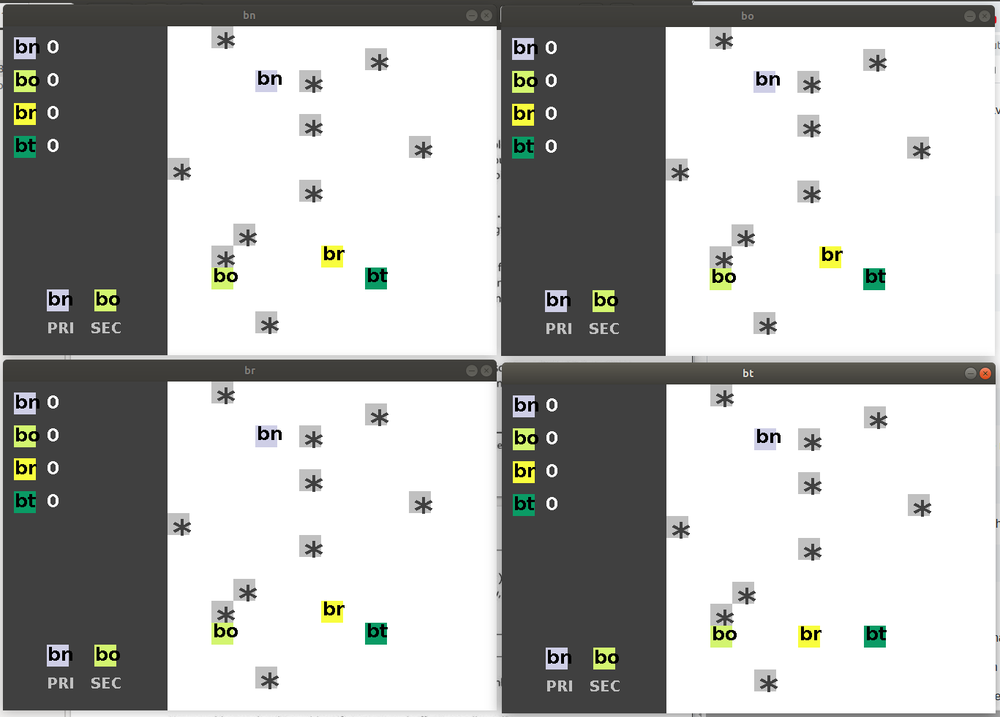

# Distributed Maze Game

This is a distributed maze game. The maze is an N-by-N grid, consisting of N by N "cells". Each cell contains either no "treasure" or exactly one "treasure". At the start of the game, there are K treasures placed randomly at the grid.



## Getting Started

These instructions will get you a copy of the project up and running on your local machine for development and testing purposes.

### Prerequisites

This StressTest program requires Java 8. If your Java version is out of date, please update to Java 8.

### Compiling

Compile Tracker

```
javac Tracker.java
```

Compile StressTest

```
javac StressTest.java
```

### Running

Start RMI registry on port 2001.

```
start rmiregistry 2001
```

Start Tracker program on port 2001. The maze size must be 15 by 15, and the number of treasures must be 10.

```
java Tracker 2001 15 10
```

Start StressTest program. Use the IP address and the port over which your Tracker program listens.

```
java StressTest 127.0.0.1 2001 "java Game"
```

### Additional Information

Internally, StressTest will invoke the following command in separate processes: java Game 127.0.0.1 2001 [player-id].

Here the [player-id] is the name of the player, which will be generated randomly internally by StressTest.

StressTest will create a new directory "CS5223_StressTest12123"and write the standard output/error of your Game program into files in that directory. These files can be freely deleted after StressTest ends.

## License

This project is licensed under the MIT License - see the [LICENSE.md](LICENSE.md) file for details
